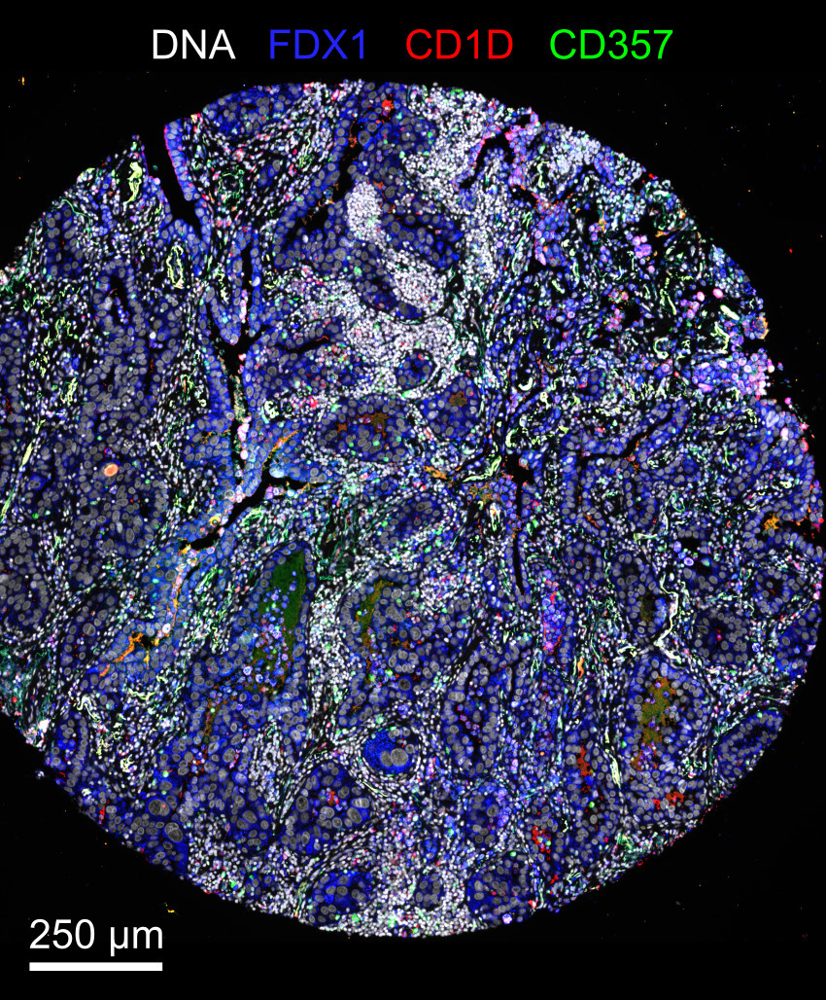
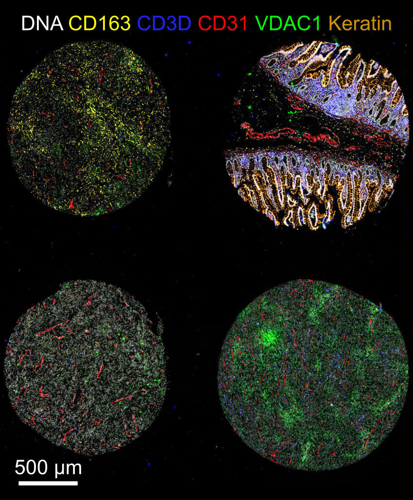



# Exemplar data

| exemplar-001 | exemplar-002 |
| :-: | :-: |
|  |  |

Two exemplars are currently available for demonstration purposes:

* `exemplar-001` is meant to serve as a minimal reproducible example for running all modules of the pipeline, except the dearray step. The exemplar consists of a small lung adenocarcinoma specimen taken from a larger TMA (tissue microarray), imaged using CyCIF with three cycles. Each cycle consists of six four-channel image tiles, for a total of 12 channels. Because this exemplar is too small for automated illumination correction, illumination profiles were precomputed from the entire TMA and included with the raw images.

* `exemplar-002` is a two-by-two cut-out from a TMA. The four cores are two meningioma tumors, one GI stroma tumor, and one normal colon specimen. The exemplar is meant to test the dearray step, followed by processing of all four cores in parallel. This dataset has ten cycles with 40 total channels and also includes precomputed illumination profiles.

Note that the representative images above only depict a subset of the full list of image channels present in each dataset.

Both exemplars can be downloaded using the following commands:
``` bash
nextflow run labsyspharm/mcmicro/exemplar.nf --name exemplar-001 --path /local/path/
nextflow run labsyspharm/mcmicro/exemplar.nf --name exemplar-002 --path /local/path/
```
with `/local/path/` pointing to a local directory where the exemplars should be downloaded to.
